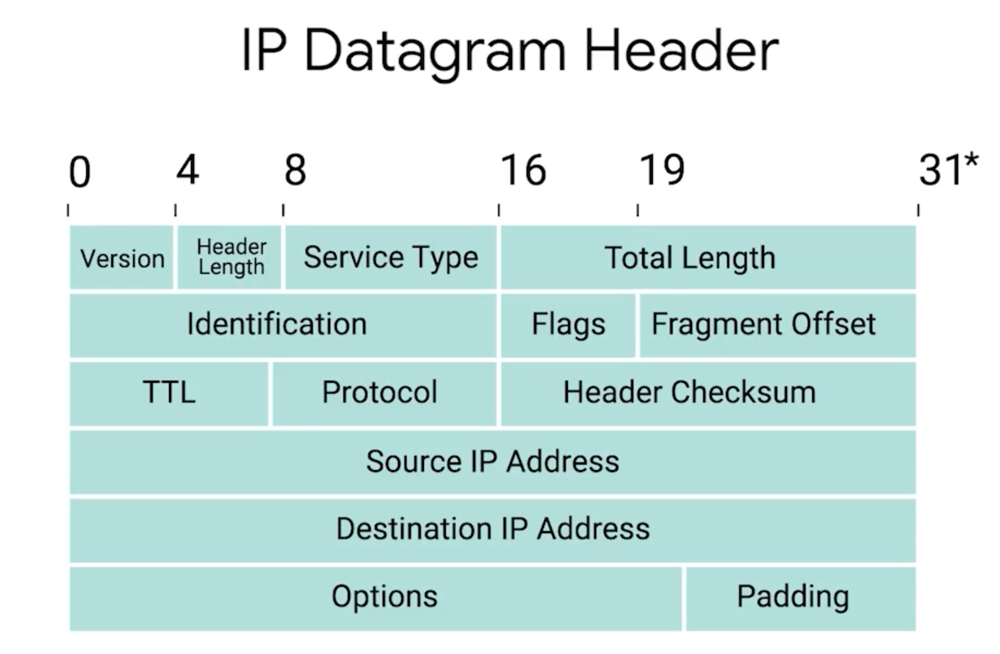

# IP

IP Addresses are belongs to the networks, not to the devices attached to those networks. 

# DHCP

An IP address is dynamically assigned to our Laptop using this protocol. This is called dynamic IP address

## Static IP address. 

In most cases, static IP addresses are reserved for servers and network devices, while dynamic IP addresses are reserved for clients.

## IP Datagram

Under the IP protocol, a packet is usually referred to as an IP datagram. Like how we called it in the Data link layer. 

Explanation: 

1. Header: Think of this as the "shipping label" of the datagram. It contains crucial information for routing and delivery. Here are some key fields within the header:

Version: Specifies the IP protocol version being used (e.g., IPv4 or IPv6).
Header Length: Indicates the size of the header itself.

### Total Length: 
Tells the total size of the datagram (header + payload).

### Time to Live (TTL): 
Limits the datagram's lifespan on the network to prevent endless loops. Decreases with each router hop.

### Protocol: 
Indicates the higher-level protocol being used (e.g., TCP or UDP).

### Source IP Address: 
The IP address of the sending device.

### Destination IP Address: 
The IP address of the receiving device.

2. Payload: 

This is the actual data being carried by the datagram. It could be anything - website content, email messages, video streams, etc.

### In essence: 

The header provides the routing and control information, while the payload carries the actual data. 

My questions:

### Q1: 

Give me some realtime example to understand above concept, For an example I watching a video or sending an email so the single email can be considered as a entire  IP datagram and this IP datagram is considered as a payload in the data link layer ? how does it works? 

## Answer: 

You're on the right track! Let's break down those real-time examples:

**Watching a Video:**

1.  **Data Packets:** When you stream a video, it's not sent as one giant file. Instead, it's broken down into many smaller data packets, each like a piece of a puzzle.

2.  **IP Datagrams:** Each of these data packets is placed inside an IP datagram. Think of the datagram as an envelope, and the data packet as the letter inside. The datagram header has the source (the video server) and destination (your IP address) information.

3.  **Data Link Layer:** You're right, at the data link layer (like Ethernet), the entire IP datagram is treated as the payload of an Ethernet frame. It's like putting the envelope (IP datagram) inside a bigger package (Ethernet frame) for delivery on your local network.

**Sending an Email:**

1.  **Email Data:** Your email message, including attachments, is also divided into data packets.

2.  **IP Datagrams:** Again, each packet is put into an IP datagram. The header will have your email provider's server as the source and the recipient's email server as the destination.

3.  **Encapsulation:**  Similar to the video example, the IP datagram becomes the payload for a data link layer frame for transmission.

**Key Points:**

*   **Encapsulation:** It's like a nesting doll! Data is packaged at different layers. The IP datagram is the payload for the data link layer, but it carries the actual application data (video or email) inside it.
*   **Addressing:** IP addresses ensure that the datagrams reach the correct destination, while MAC addresses (at the data link layer) handle delivery on the local network segment.

## Q2: 

Understood! See the whole video or email or attachment are chunked into a pieces of data packets which IP datagram in network layer. Each chunk is marked with some header and source/destination IP addresses. At the receiver end how did these chunks of data is combined and visible to us a video or a attachment ?

## Answer: 

Excellent question! You're getting the hang of it. Here's how those data chunks are reassembled at the receiver:

**1. Arrival and Ordering:** The IP datagrams, each carrying a chunk of the video or email, arrive at the destination. They might not arrive in the order they were sent due to different network paths.

**2. TCP to the Rescue:** This is where the Transport Layer, specifically TCP (Transmission Control Protocol), comes in. Think of TCP as a reliable delivery service.

    * **Sequence Numbers:** Each datagram's header contains sequence numbers that TCP uses to put them back in the correct order.
    * **Missing Pieces:** TCP detects if any datagrams are missing and requests retransmission from the sender.
    * **Reassembly:** Once all the datagrams arrive in order, TCP reassembles them into the original data stream.

**3. Back to the Application:** Finally, the reassembled data (the complete video, email, or attachment) is handed back to the application (like your web browser or email client) for you to view.

**Key Points:**

*   **TCP's Role:** TCP is crucial for reliable data transmission. It ensures all the pieces arrive and are put back together correctly.
*   **Abstraction:** You don't see this complex process of fragmentation, reassembly, and error checking. It happens behind the scenes, so you have a seamless experience.

Let me know if you have any other questions. 

## Q3: 

How does the fragmentation process work when sending large data?  

You're diving deeper into the world of networking! That's great! Here's how fragmentation works:

**1. Maximum Transmission Unit (MTU):**  Every network link (like Ethernet or Wi-Fi) has a maximum packet size it can handle, called the MTU. 

**2. Fragmentation Need:** If an IP datagram is larger than the MTU of a network it needs to cross, it must be fragmented.

**3. Fragmentation Process:**

   * **Identification:** The original datagram is divided into smaller fragments. Each fragment gets the same unique identification number in its header so they can be reassembled later.
   * **Fragment Offset:** Each fragment also gets an offset value indicating its position in the original datagram (like page numbers in a book).
   * **More Fragments Flag:** A flag in the header indicates if there are more fragments to come or if this is the last one.

**4. Reassembly at Destination:**

   * The receiving host uses the identification, offset, and flags to reassemble the fragments back into the original datagram.
   * Once all fragments arrive, the data is passed to the upper layers.

**Important Notes:**

* **Overhead:** Fragmentation adds some overhead because each fragment needs its own header information.
* **Efficiency:** It's generally more efficient if fragmentation can be avoided. Some protocols try to determine the path MTU to prevent fragmentation along the way.

Let me know if you'd like more details on any specific part of the process! 

# ARP - Address Resolution Protocol

A protcol used to discover the hardware address of a node with a certain IP address. 

