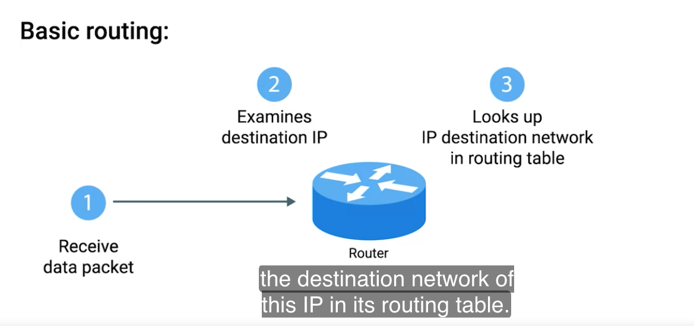

# Router 

A network device h=that forwards the traffic depending on the destination address of that traffic. 
A router a device that at least should have two interfaces. 

# Basic routing flow (Network layer)

1. Receive data packet 
2. Look for the destination IP in the IP datagram
3. It will check its routing table based on the network address in the destination IP
4. Forwards the traffic to the netwok.

## Routing table

Routing table contains 4 columns

1. Destination Network

* This column would contain a row for each network that the router knows about. 
* Normally the network ID, CIDR, subnetmask (i.e 192.168.1.1/24)

2. Next hop

* This is the IP address of the next router that should receive data intended for the destination networking question. 

3. Total hops

* router must know how many more hops are required to the destination

4. Interface

* Router has to know in which of the interface should the destination traffic should be forwarded using it. 

# Interior Gateway

## Routing protocols:

* These are special protocols the routers use to speak to each other in order to share what information they might have.
* Routing protocols further divided into two main  categories 

### Interior gateway protocols 

#### Defintion: 

* Interior protcols are used by routers to share information within a single autonomous system

#### Autonomous system:

* A collection of networks that all fall under the control of single network operator.

* distance-vector protocols
    * Basically it takes the networks in its routing table and checks how far away these networks in terms of hops.
    * Once collected the informations it sends to ONLY to the neighbouring router. 
    * In computer science, a list is known as a vector 

* Link state routing protocols
    * Link state protocols shares the information across all the routers not ONLY to the neighbouring routers. 
    * In this way, each router in the world knows about the other routers routing table
    * Which helps for the each router to find the best path while forwarding the data
    * Due to this router needs a huge storage and processing capacity to run these algorithms

### Exterior gateway protocols

* Exterior protocols are used to share the routing information across two independent autonomous systems. 
* Routers wil share their informations across different organization.

# IANA (Internet Assigned Numbers Authority)

* A non-profit organization that helps manage things like IP address allocation. 
* Along with managing IP address allocation, then IANA is also responsible for ASN, Autonomous System Number allocation. 
* ASN (Autonomous System Number) - A number assigned to the individual autonomous systems.

# RFC(Request For Comments) 1918 address space(Non routable address space)

* RFC defines a non routable address space in the internet. Which means the core router does not need to forward any traffic to these IP ranges.

* 10.0.0.0/8
* 172.16.0.0/12
* 192.168.0.0/16 

* Above IP ranges can be used by anyone in the world for their internal networks