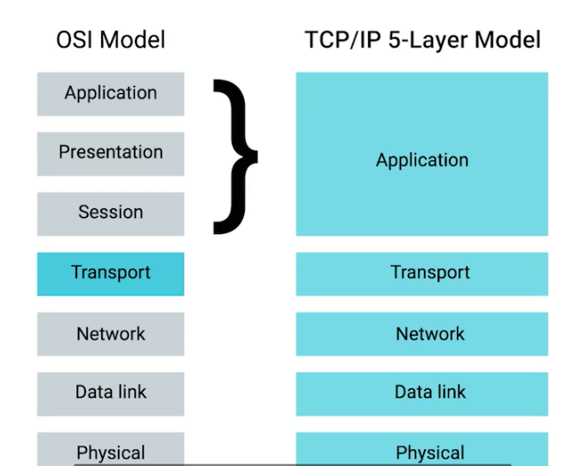

# Application Layer

* This is actual data like video, document etc. 
* There are many protocols used in this layer
* For the web-traffic the application layer protocol is HTTP.

## OSI - Open System Interconnect Model

### Session Layer

* This is the 5th Layer of the OSI model. Responsible for facilitating the communication between actual applications and transport layer.

### Presentation Layer

* Responsible for making sure that the unencapsulated application layer data is able to understood by the application in question. 

