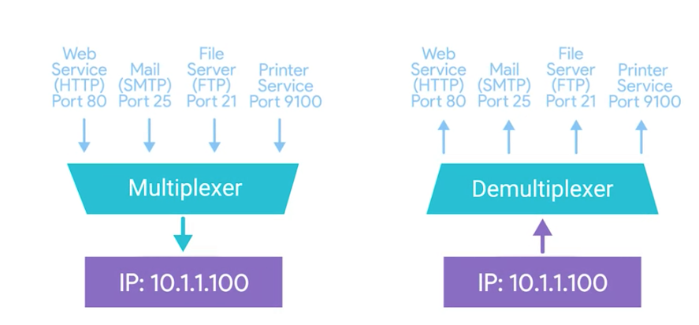
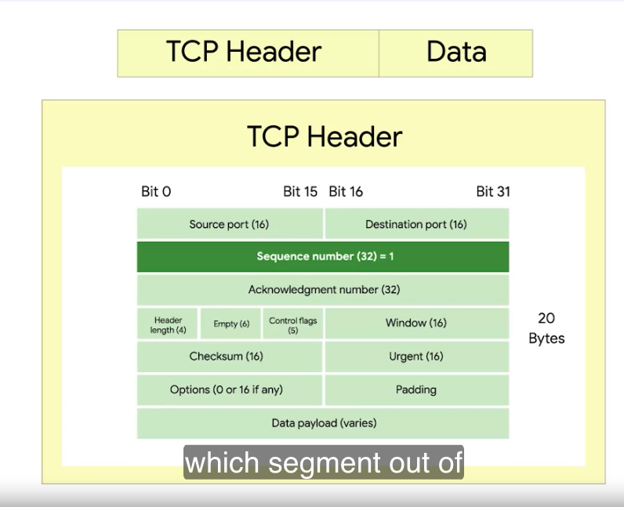
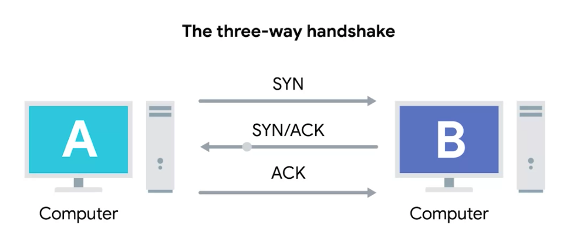

# Transport Layer

* Discuss about, how the individual programs can communicate each other in the networking.

## Multiplexking, Demultiplexing

# TCP Dissection

***TCP Segment*** - It contains TCP header and data section(Another payload area where application layer places it's data).

## TCP Header

A TCP Header itself contains a lot of ports.

* **TCP Header:** This is like the address label on the package. It contains crucial information for delivery, such as:
    * **Source and Destination Ports:**  Identifies the specific application (like a web browser or email client) on both  the sending and receiving computers. Source port is a high numbered port chosen from a special section of ports known as ephemeral ports.
    * **Sequence Number:**  32bit number. Acts like a package ID, ensuring data arrives in the correct order.
    * **Acknowledgement Number:** Confirms receipt of previous segments.
    * **Data Offset field:** A 4-bit number that communicates how long the TCP header for this segment is
    * **window(16):** 16-bit number specifies the range of sequence numbers that might be sent before an acknowledgement is required.
    * **Control Flags:** Special instructions, like indicating the start or end of a message.
    * **Checksum:**  Verifies data integrity, ensuring the package wasn't damaged in transit.

* **Data:** This is the actual content of the package, like the files or messages being sent.

This structure ensures reliable and ordered data transmission between applications over a network. 

# TCP Control flags(6)

  * **URG (urgent):** A value of one here indicates that the segment is considered urgent and that the urgent pointer field has more data about this.
  * **ACK(Acknowledged):** A value of one in this field means that the acknowledgement number field should be examined
  * **PSH(push):** The transmitting device wants the receiving device to push currently-buffered data to the application ion the receiving end as soon as possible
  * **RST(reset):** One of the sides in a TCP connection hasn't been able to properly recover from a series of missing or malformed segments
  * **SYN(synchronize):** It's used when first establishing a TCP connection and makes sure the receiving end knows to examine the sequence number field
  * **FIN(finish):** When this flag is set to one, it means the transmitting computer doesn't have any more data to send and the connection can be closed.

## Three way-hand shake. 

* Below picture depicts how the TCP connection is established between two computers in the network before they start sending data. 

# TCP Socket states

## Socket: 

* The instantiation of an endpoint in a potential TCP connection. This socket has to be instantiated by the actual program intended for.

Let's break that down:

* **Instantiation:**  Think of this as bringing something to life from a blueprint.  It's the actual, working version.
* **Endpoint:** This is one side of a two-way communication channel. Like how a phone call needs two connected phones.
* **Potential TCP Connection:** This means the socket is ready for a connection using the TCP protocol, but a connection might not be active yet.

In simpler terms, a socket is like a door on your computer specifically designed for network communication. It needs to be "opened" by a program to send or receive data. 
