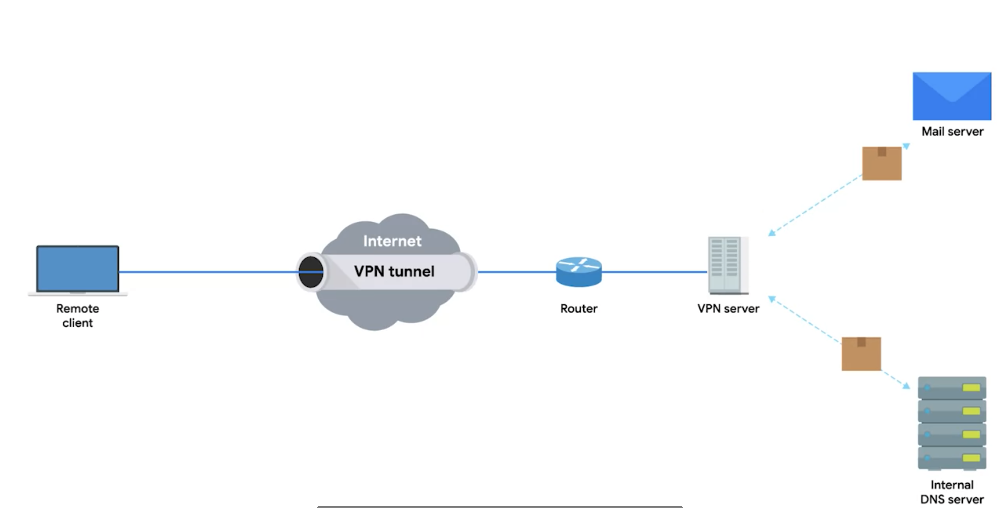
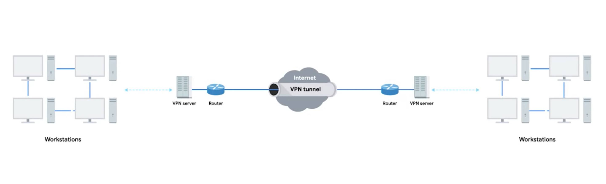

# Virtual Private Network

* A technology that allows for the extension of a private or local network to hosts that might not work on that same local network

## VPN Tunnel

* When establishinh a VPN connection to the office network it also established the VPN tunnel for secure communication. 

* This VPN tunnel is keen about the transport layer's Payload part. It encrypts this payload and decrypts at the remote network end

## Site-to-site VPN

* VPN can also be used for site-to-site connection.
* Sometimes a router or special VPN device can establish a connection from one network to another network's router or specialized VPN device. 

